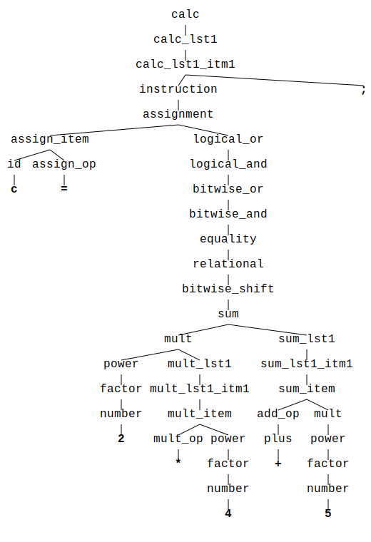

[](https://travis-ci.org/jsinger/id-tree-layout)
[](https://docs.rs/id_tree_layout)

# id_tree_layout

A library to visualize tree structures tailored for the
*[id_tree](https://github.com/iwburns/id-tree)* crate.

## Overview

This crate evolved as a side-product while working on a parser generator (still work in progress).
To check the correctness of generated parsers I needed to visualize large parse trees.

Here is what the result looks like:



It turned out that the task to visualize trees is a universal one. So I decided to provide a
separate crate for the community.

While striving for universality it was not easy to completely abstract from the concrete tree data
structure people might ever use. Thus I decided to use the well known `id_tree`'s tree
implementation as the foundation for this crate.

The other abstraction I wanted to face was the concrete node data type and how it should be
presented for a tree visualization. To resort to the implementation of the node's data type's
`Display` trait seemed not to be specific enough. It would imply that the visualization of a
node in a graph is the same as the one used on console display.

As a solution with lowest impact on users code I decided to demand the user to implement one single
trait for his node's data type: `Visualize`. This trait only contains two methods and only one of
them is mandatory to implement.

With this in mind there are two major restrictions one should know when to consider this crate to
visualize trees:

* This crate only works together with tree types provided by the `id_tree` crate.
* The user of the crate needs to implement the `Visualize` trait for his node's data type.

The library provides a third abstraction. It is about how an embedding of nodes in the plane is
presented to the user, i.e. in which format the embedding is converted in the end. For the sake of
simplicity the `id_tree_layout` crate offers a simple default solution for this task, the SvgDrawer
type. It provides elementary representation of the embedding in SVG format. But if the user wants
to use its own realization, for instance to print the embedding onto a bitmap, he can integrate
into the graph generation easily. All he needs to do is to implement the `Drawer` trait for his
drawer.

## Example Usage

```rust
use id_tree::InsertBehavior::{AsRoot, UnderNode};
use id_tree::{Node, NodeId, Tree, TreeBuilder};
use id_tree_layout::{Layouter, Visualize};

struct MyNodeData(i32);

// You need to implement id_tree_layout::Visualize for your nodes data type.
// This way you provide basic formatting information.
impl Visualize for MyNodeData {
    fn visualize(&self) -> std::string::String {
        // We simply convert the i32 value to string here.
        self.0.to_string()
    }
    fn emphasize(&self) -> bool {
        // This simply emphasizes only to leaf nodes.
        // It only works for this example.
        self.0 > 1
    }
}

fn main() {
    //      0
    //     / \
    //    1   2
    //   / \
    //  3   4
    let mut tree: Tree<MyNodeData> = TreeBuilder::new().with_node_capacity(5).build();

    let root_id: NodeId = tree.insert(Node::new(MyNodeData(0)), AsRoot).unwrap();
    let child_id: NodeId = tree.insert(Node::new(MyNodeData(1)), UnderNode(&root_id)).unwrap();
    tree.insert(Node::new(MyNodeData(2)), UnderNode(&root_id)).unwrap();
    tree.insert(Node::new(MyNodeData(3)), UnderNode(&child_id)).unwrap();
    tree.insert(Node::new(MyNodeData(4)), UnderNode(&child_id)).unwrap();

    Layouter::new(&tree)
        .with_file_path(std::path::Path::new("test.svg"));
        .write().expect("Failed writing layout")
}

```
